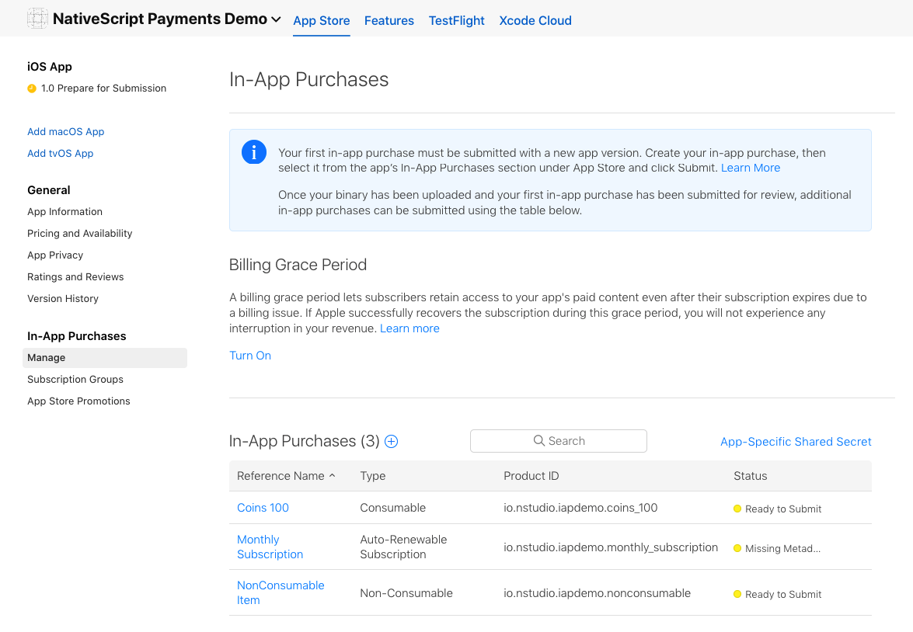
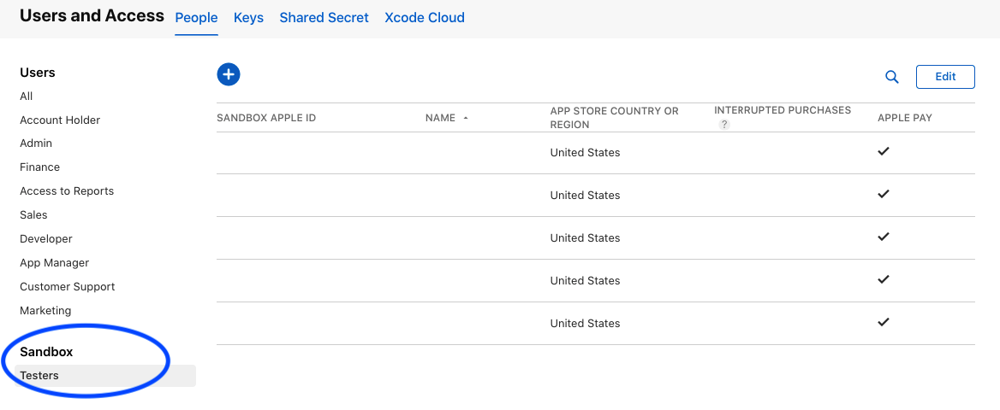

# @nativescript/payments

```bash
ns plugin add @nativescript/payments
```

** Note **
This plugin uses a RxJS Observable to emit the events to handle the purchase flow. To avoid threading errors with the platform purchasing flow, you can use `toMainThread()` as a pipe on the Observable so that the purchase logic executes on the main thread. `payments$.pipe(toMainThread()).subscribe((event: PaymentEvent.Type) => {...`
The sample below should give a good starting point on how to use the Observable and setup the purchasing mechanism.

## Prerequisites

Before you get started, review the following prerequisites:

### Apple (iOS)

To offer in app purchases for your iOS app. You will need to create items for the app on [AppStoreConnect.Apple.Com](https://appstoreconnect.apple.com).



To test iOS purchases fully, you will need a real iOS device. You will also need a [test user in the sandbox environment](https://appstoreconnect.apple.com/access/testers) on your appstore account.



## Usage

```typescript
import { ObservableArray } from '@nativescript/core';
import { buyItem, BuyItemOptions, fetchItems, finalizeOrder, init as initPayments, Item, PaymentEvent, payments$, toMainThread } from '@nativescript/payments';

export class SomeViewModel {
	private item: Item;

	pageLoaded() {
		// Connect to the RxJS Observable
		payments$.connect();

		// Subscribe to the RxJS Observable
		// You do not have to handle all of the events
		// RETRIEVING_ITEMS && PROCESSING_ORDER are the ones you'll want to use to handle the purchase flow
		const subscription = payments$.pipe(toMainThread()).subscribe((event: PaymentEvent.Type) => {
			switch (event.context) {
				case PaymentEvent.Context.CONNECTING_STORE:
					console.log('Store Status: ' + event.result);
					break;
				case PaymentEvent.Context.RETRIEVING_ITEMS:
					if (event.result === PaymentEvent.Result.SUCCESS) {
						// keeping a reference to the ONE item we fetched
						// if you passed multiple items you will need to handle accordingly for your app
						this.item = event.payload;
					}
					break;
				case PaymentEvent.Context.PROCESSING_ORDER:
					if (event.result === PaymentEvent.Result.FAILURE) {
						console.log(`🛑 Payment Failure - ${event.payload.description} 🛑`);
						// handle the failure of the purchase
					} else if (event.result === PaymentEvent.Result.SUCCESS) {
						// handle the successful purchase
						console.log('🟢 Payment Success 🟢');
						console.log(`Order Date: ${event.payload.orderDate}`);
						console.log(`Receipt Token: ${event.payload.receiptToken}`);
						finalizeOrder(event.payload);
					}
					break;
				case PaymentEvent.Context.FINALIZING_ORDER:
					if (event.result === PaymentEvent.Result.SUCCESS) {
						console.log('Order Finalized');
					}
					break;
				case PaymentEvent.Context.RESTORING_ORDERS:
					console.log(event);
					break;
				default:
					console.log(`Invalid EventContext: ${event}`);
					break;
			}
		});

		// This initializes the internal payment system for the plugin
		initPayments();

		// This will request the items from the app store for the app
		// The event RETRIEVING_ITEMS will emit and where you can keep a reference to the ITEM(s) that the user is potentially purchasing
		fetchItems(['io.nstudio.iapdemo.nonconsumable', 'io.nstudio.iapdemo.coins_100']);
	}

	buttonTap() {
		const opts: BuyItemOptions = {
			accountUserName: 'someuseraccount123@test.orgbizfree',
			android: {
				vrPurchase: true,
			},
			ios: {
				quantity: 1,
				simulatesAskToBuyInSandbox: true,
			},
		};

		// This method will kick off the platform purchase flow
		// We are passing the item and an optional object with some configuration
		buyItem(this.item, opts);
	}
}
```

## License

Apache License Version 2.0
