# @nativescript/payments

```bash
ns plugin add @nativescript/payments
```

## Prerequisites

Before you get started, review the following prerequisites:

### Apple (iOS)

To offer in app purchases for your iOS app. You will need to create items for the app on [AppStoreConnect.Apple.Com](https://appstoreconnect.apple.com).

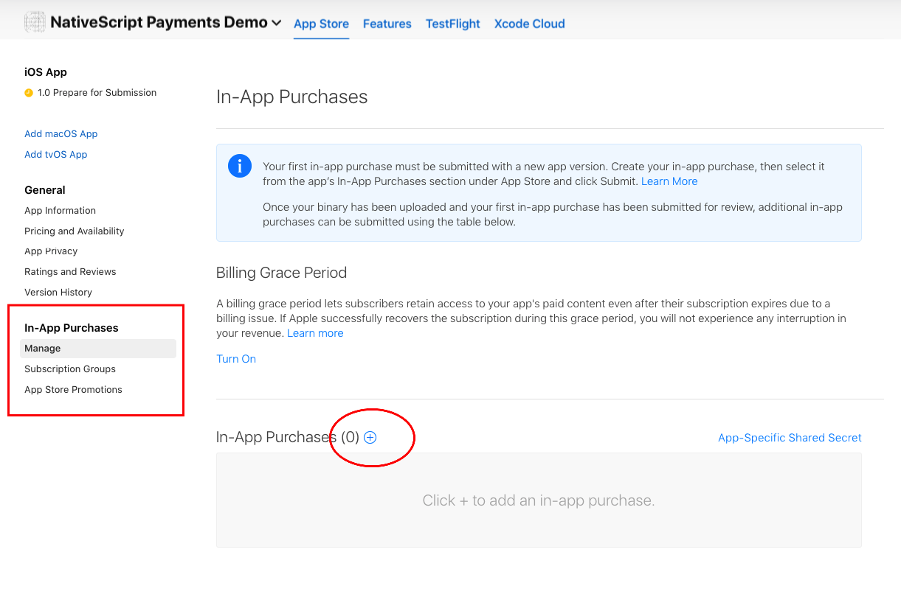

On the form to create the in app purchase item, the `Product ID` is the value you will use to fetch your items for the user to purchase in your app.
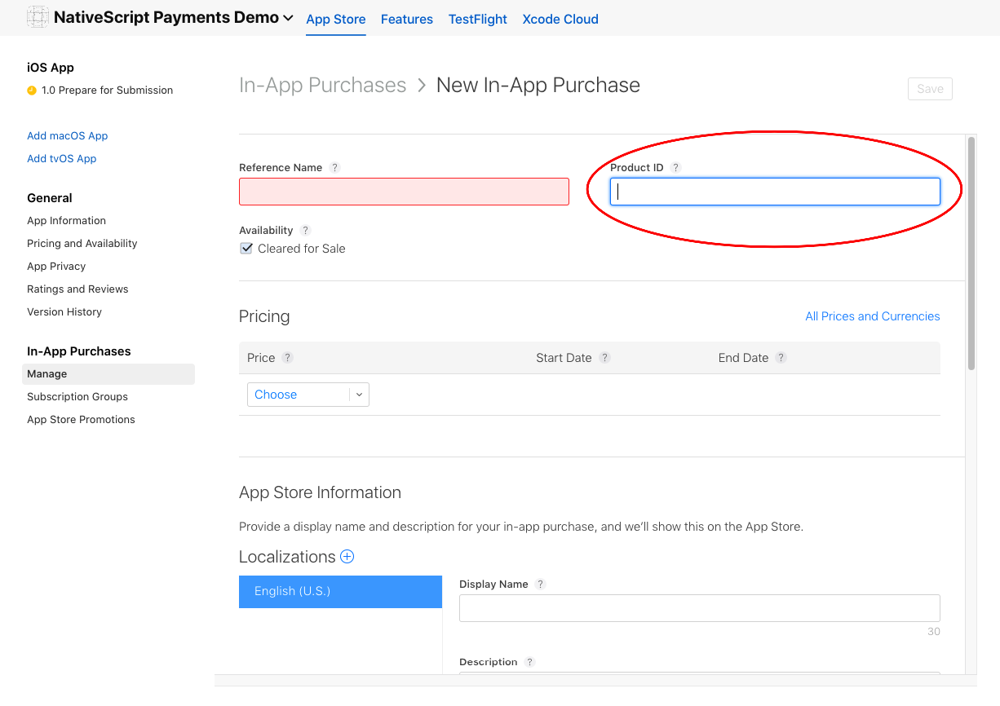

Once you complete an item you will see a list of all items for the app listed on the AppStore Connect.
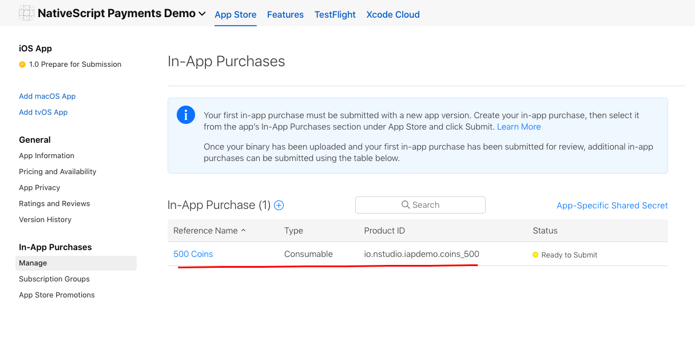

To test iOS purchases fully, you will need a real iOS device. You will also need a [test user in the sandbox environment](https://appstoreconnect.apple.com/access/testers) on your appstore account.

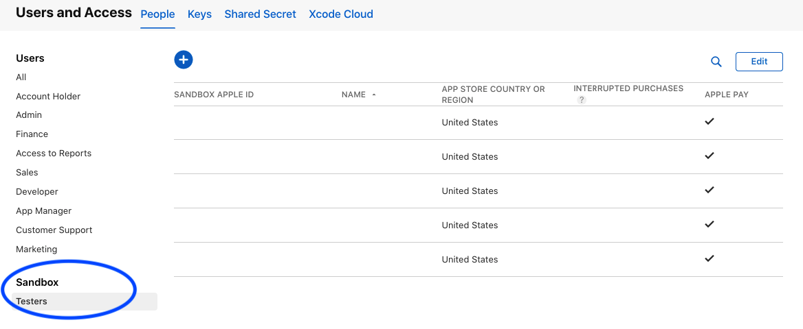

### Google (Android)

To offer in app purchases for your Android app you will need to upload at least ONE apk/aab to the [Google Play Console](https://play.google.com).

Once you have uploaded one aab to the console for your app you can create in app products on the console.
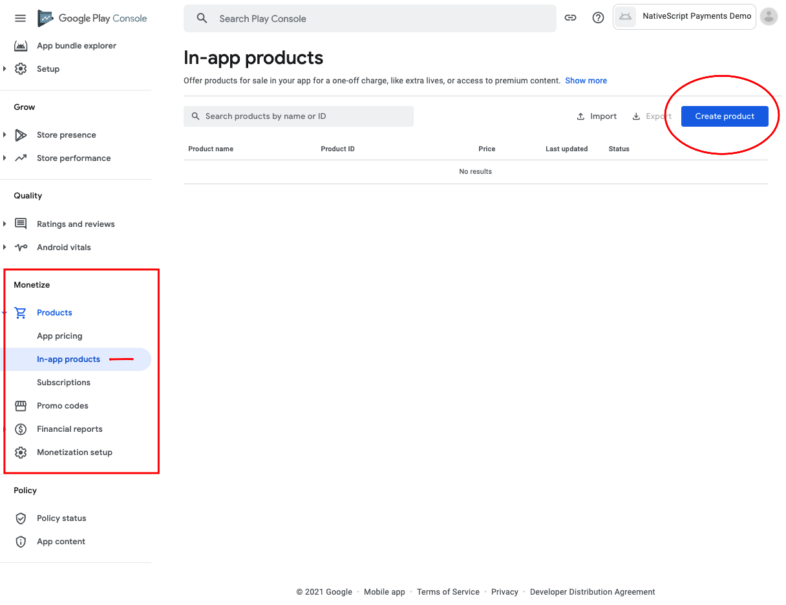

On the form to create your product, the `Product ID` is the value you will use to fetch your products for the user to purchase.

**Important Tip for Google Products**
Google does not like numeric values in the ID field. It seems to ignore the Sku when querying for your items and only returns one item instead of multiple values if the IDs contain numeric values.

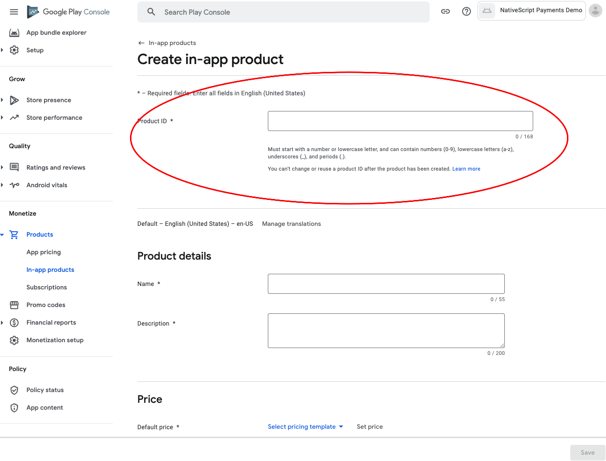

**Important note about Google items**
Google in app products will not work until Google has reviewed the app. They will appear in the list of products, but the API will error trying to purchase them. The title of the item when you call `fetchItems(['your.product.id']) should be suffixed with (in review) or something similar when returned at this point. You will not be able to finish the purchase flow until the review period has passed.

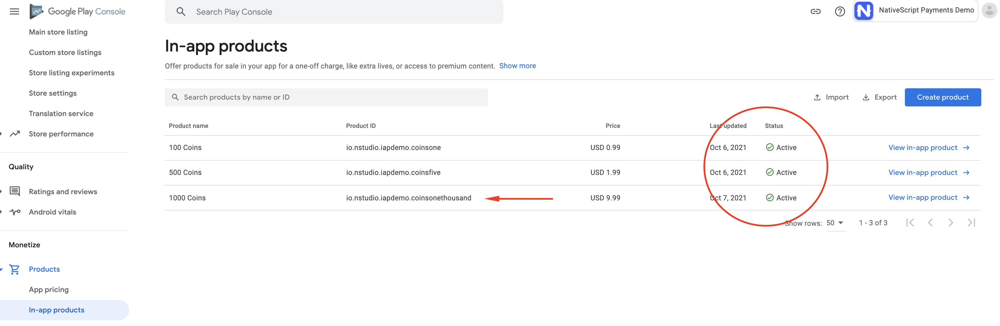

To test Android purchases completely, you should use a real device with Google Play setup and logged into an account. You can use [test accounts
for Google Play Billing](https://developer.android.com/google/play/billing/test) for the work flow. This will allow you to test the app in development properly. For more info: https://support.google.com/googleplay/android-developer/answer/6062777

**Note about the plugin usage:**
This plugin uses a RxJS Observable to emit the events to handle the purchase flow. To avoid threading errors with the platform purchasing flow, you can use `toMainThread()` as a pipe on the Observable so that the purchase logic executes on the main thread. `payments$.pipe(toMainThread()).subscribe((event: PaymentEvent.Type) => {...`
The sample below should give a good starting point on how to use the Observable and setup the purchasing mechanism.

## Usage

The standard flow of method calls:

```typescript
// This sets up the internal system of the plugin
init();
// Connect the RxJS Observable
payments$.connect();
// Establish the Subscription with your event handling
payments$.pipe(toMainThread()).subscribe((event: PaymentEvent.Type) => {...

// fetchItems([]) will query the store for your items requested
// you will handle these items inside the PaymentEvent.Context.RETRIEVING_ITEMS event
fetchItems(['your.item.ids']);

// buyItem('') will start the purchase flow on Android & iOS
// Now you will wait to handle the PaymentEvent.Context.RETRIEVING_ITEMS event
// for SUCCESS or FAILURE
buyItem('item.id');

// finalizeOrder(payload) will complete the purchase flow, the payload argument here
// is provided in the PaymentEvent.Context.PROCESSING_ORDER - SUCCESS event (see below example for detailed usage)
finalizeOrder(payload)

// at this point you would process the order with your backend given the receiptToken from the purchase flow
```

## Example

```typescript
import { buyItem, BuyItemOptions, fetchItems, finalizeOrder, init as initPayments, Item, PaymentEvent, payments$, toMainThread } from '@nativescript/payments';

export class SomeViewModel {
	private item: Item;

	pageLoaded() {
		// Connect to the RxJS Observable
		payments$.connect();

		// Subscribe to the RxJS Observable
		// You do not have to handle all of the events
		// RETRIEVING_ITEMS && PROCESSING_ORDER are the ones you'll want to use to handle the purchase flow
		const subscription = payments$.pipe(toMainThread()).subscribe((event: PaymentEvent.Type) => {
			switch (event.context) {
				case PaymentEvent.Context.CONNECTING_STORE:
					console.log('Store Status: ' + event.result);
					break;
				case PaymentEvent.Context.RETRIEVING_ITEMS:
					if (event.result === PaymentEvent.Result.SUCCESS) {
						// keeping a reference to the ONE item we fetched
						// if you passed multiple items you will need to handle accordingly for your app
						this.item = event.payload;
					}
					break;
				case PaymentEvent.Context.PROCESSING_ORDER:
					if (event.result === PaymentEvent.Result.FAILURE) {
						console.log(`🛑 Payment Failure - ${event.payload.description} 🛑`);
						// handle the failure of the purchase
					} else if (event.result === PaymentEvent.Result.SUCCESS) {
						// handle the successful purchase
						console.log('🟢 Payment Success 🟢');
						console.log(`Order Date: ${event.payload.orderDate}`);
						console.log(`Receipt Token: ${event.payload.receiptToken}`);
						finalizeOrder(event.payload);
					}
					break;
				case PaymentEvent.Context.FINALIZING_ORDER:
					if (event.result === PaymentEvent.Result.SUCCESS) {
						console.log('Order Finalized');
					}
					break;
				case PaymentEvent.Context.RESTORING_ORDERS:
					console.log(event);
					break;
				default:
					console.log(`Invalid EventContext: ${event}`);
					break;
			}
		});

		// This initializes the internal payment system for the plugin
		initPayments();

		// This will request the items from the app store for the app
		// The event RETRIEVING_ITEMS will emit and where you can keep a reference to the ITEM(s) that the user is potentially purchasing
		fetchItems(['io.nstudio.iapdemo.coinsfive', 'io.nstudio.iapdemo.coinsone', 'io.nstudio.iapdemo.coinsonethousand']);
	}

	buttonTap() {
		const opts: BuyItemOptions = {
			accountUserName: 'someuseraccount123@test.orgbizfree',
			android: {
				vrPurchase: true,
			},
			ios: {
				quantity: 1,
				simulatesAskToBuyInSandbox: true,
			},
		};

		// This method will kick off the platform purchase flow
		// We are passing the item and an optional object with some configuration
		buyItem(this.item, opts);
	}
}
```

## Result

### iOS

| Example Item List                                                             | Purchase Confirmation                                                         | Purchase Done                                                         | Purchase Successful                                                      |
| ----------------------------------------------------------------------------- | ----------------------------------------------------------------------------- | --------------------------------------------------------------------- | ------------------------------------------------------------------------ |
| 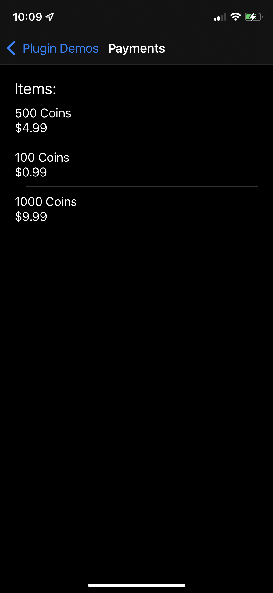 | 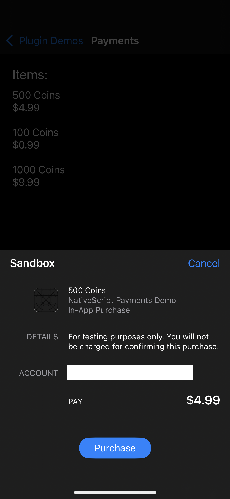 | 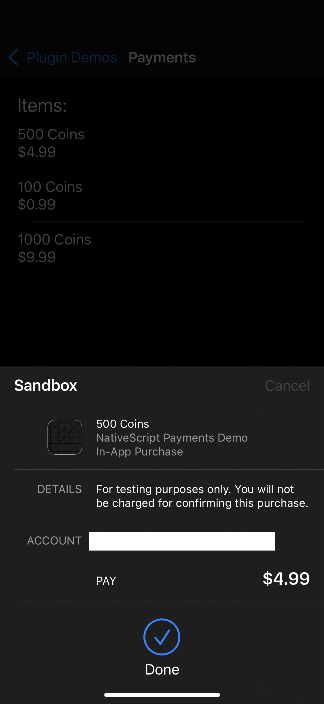 | 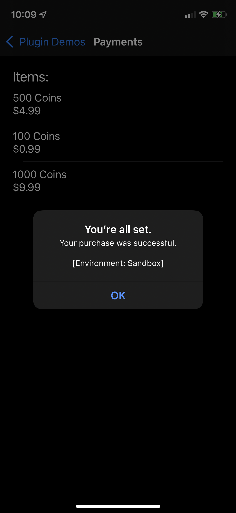 |

### Android

| Example Item List                                                        | Purchase Confirmation                                                             | Purchase Successful                                                             |
| ------------------------------------------------------------------------ | --------------------------------------------------------------------------------- | ------------------------------------------------------------------------------- |
| 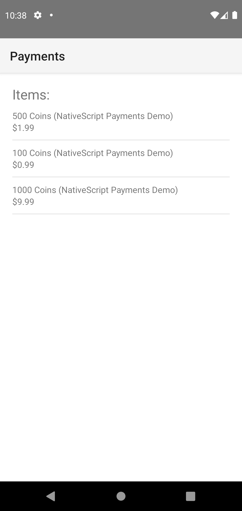 | 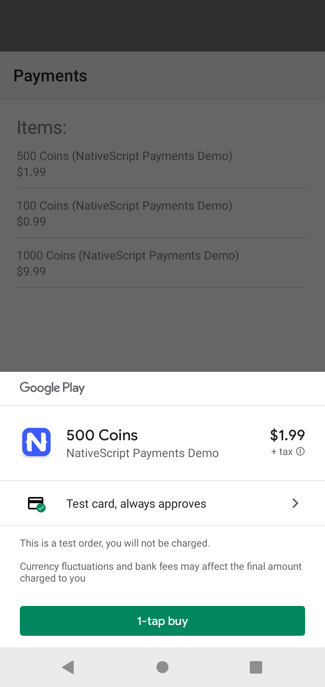 | 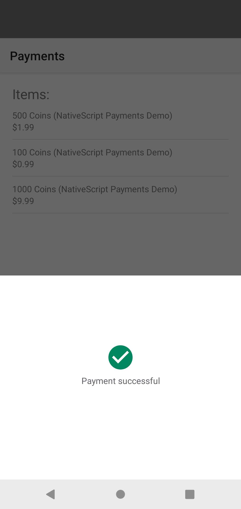 |

## License

Apache License Version 2.0
